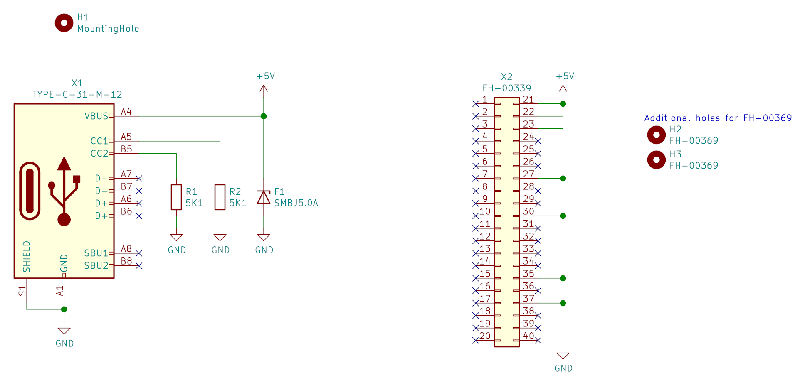

# Raspberry Pi 4B Power Adapter

## Schematic

## PCB

## BOM
| Comment        | Designator | Footprint                                                 | LCSC Part | Alternative LCSC Part |
|----------------|------------|-----------------------------------------------------------|-----------|-----------------------|
| SMBJ5.0A       | F1         | Diode_SMD:D_SMB                                           | C10204    |                       |
| 5K1            | R1,R2      | Resistor_SMD:R_0603_1608Metric                            | C23186    |                       |
| TYPE-C-31-M-12 | X1         | Connector_USB:USB_C_Receptacle_HRO_TYPE-C-31-M-12         | C165948   |                       |
| FH-00339       | X2         | Connector_Harwin:Harwin_M20-7812045_2x20_P2.54mm_Vertical | C2685112  | C2685115, C2685092    |